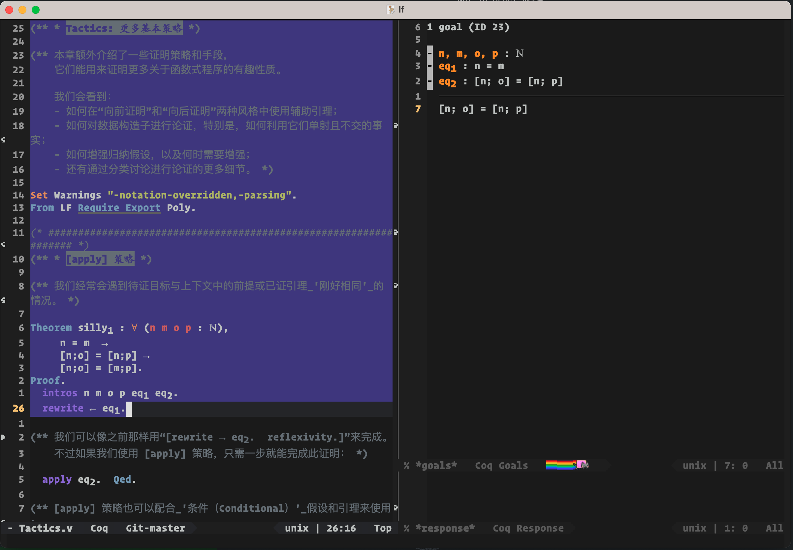

# .emacs.d (Under development)

[](https://github.com/Yescafe/.emacs.d/actions)

## 前言

这是我 2022 年底的新 Emacs 配置，主要是区分开 vim 和 Emacs 的职能：vim 已经不再使用 SpaceVim，将使用我自己编写的单个配置文件进行一些简单的代码编辑；neovim 暂时仍使用 SpaceVim，后期可能要考虑用 Lua 重写，然后将 vim 环境完全迁移到 neovim；Emacs 放弃 Purcell、Doom、SpaceVim 的一系列「重量级」配置，从零开始构建一个编写 Haskell、Coq、LaTeX 等（可能会考虑 C++、Rust、ReScript？）的 domain spcific editor；其它特定语言，还是使用 JetBrains 的对应 IDE + IdeaVim。

计划是启动 Emacs 和 evil-mode 的双键位并可以随时切换。

这个配置的初始可用版本的可能会较晚才能实现，因为我现在也用不上上面说的那些语言，所以抽空更。

## 使用

安装 Emacs（26、27、28），然后克隆配置：

```shell
cd ~
git clone https://github.com/Yescafe/.emacs.d
cd .emacs.d
cp local-configs.el.template local-configs.el
```

可以在 `local-configs.el` 中添加本地配置，如字体设置等。


### 如何不破坏本机环境尝试本配置 - 使用 Docker

在当前 Emacs 配置的目录下执行：

```shell
docker build -t ic-emacs .
docker run -it ic-emacs
```

当然也可以选择与 Docker 容器分享母机的目录，参考：

```shell
docker run -v $HOME/repos:/root/repos -it ic-emacs
```

这个例子是将母机的 `$HOME/repos` 挂载到了容器的 `/root/repos` 上。


## 环境

以 macOS 为例。

### Haskell

需要安装 GHCup，然后用 GHCup 安装相应的 haskell-language-server 和 ghc。

```shell
brew install ghcup
ghcup install hls
ghcup install ghc
```

而后需要确保 `$HOME/.ghcup/bin` 在 Emacs 的 PATH 里。比如在 shell 中启动 Emacs，需要 `$HOME/.ghcup/bin` 在 shell 的 PATH 中；~~对于 Emacs plus 使用图标启动，需要将 `$HOME/.ghcup/bin` 添加到 `/Applications/Emacs.app/Contents/Info.plist` 的 PATH 中（可搜索 LSEnvironment 或 PATH）~~ 这个方法可能没有效果，待补。


### Coq

~~首先安装 Coq：~~

```shell
brew install coq
```

测试了目前上面的方法不行，要下 [CoqIDE](https://github.com/coq/platform/releases)，然后将 CoqIDE 中的 bin 目录添加到 Emacs 的 PATH 中，比如我这是 `/Applications/Coq-Platform~8.15~2022.04.app/Contents/Resources/bin`。

然后在 shell 中打开 project 的文件夹，在文件夹中打开 Emacs，这样就能正确配置 project root 让 Emacs 中的环境可以正确运行。

从 project 的其它文件 require，需要编写 `_CoqProject`, 而后用 `coq-makefile -f _CoqProject *.v -o Makefile`，再在 Emacs 中 `M-x compile` 或在 shell 中 `make`。之后就可以在 Emacs 中正常使用 proof general 提供的功能，如 `C-c RET` 可以运行到某一处。具体功能不再阐述。

效果：




